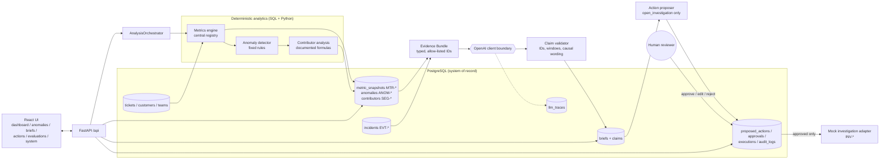

# OpsPilot

**AI Support Operations Command Center**: a vertical slice that turns support operations data into deterministic metrics, detected anomalies, contributor analysis, evidence-backed AI briefs, and human-approved operational actions.

OpsPilot answers three questions from one system, auditably:

1. What changed?
2. Why does it matter?
3. What should somebody do next?

Code computes the facts. The model narrates and proposes, but it is never the source of truth for an operational metric, and it can never approve its own action.

> V1 uses **synthetic data only** and is production-*like*, not production-ready. See [Known V1 limitations](#known-v1-limitations) and the [Productionization checklist](#productionization-checklist).

## The problem and the customer scenario

A support operations manager at a fictional B2B SaaS company starts the day with dashboards, ticket queues and a deployment log. Something has changed, and they need to know three things: what changed, whether it matters, and what to do about it. They need answers they can defend, not a plausible paragraph.

The demo dataset has 45 days of tickets ending 2026-10-03 UTC. It contains one planted story. A Billing API deployment lands at 2026-10-01 14:00 UTC, and Billing ticket volume then rises. The rise is concentrated in **EMEA Enterprise** customers.

OpsPilot detects the anomaly deterministically and ranks the contributing segments. A brief then says what happened, citing each fact. It says the deployment *coincided with* the rise and warrants investigation; it does **not** say the deployment caused it. Next, OpsPilot drafts an investigation for a human to review, edit and approve. Only after that approval can it be executed, through a mock adapter that returns an `INV-*` reference.

## Tech stack

| Layer | Technology |
|---|---|
| Frontend | React, TypeScript, Vite, Tailwind CSS, Recharts |
| Backend | Python, FastAPI, Pydantic |
| Data | PostgreSQL, SQLAlchemy 2.x, Alembic |
| AI | OpenAI API behind a single application-owned client boundary |
| Testing | Pytest, Vitest + Testing Library, Playwright |
| Quality | Ruff, Mypy, ESLint, `tsc --noEmit` |
| Runtime | Docker Compose |

## Architecture



Each layer has one job:

- Routes stay thin: `route -> service -> repository/engine`.
- `AnalysisOrchestrator` (`backend/app/services/analysis/orchestrator.py`) is the single analysis path: metric history → anomaly detection → contributors → evidence bundle → brief and validation. The brief step runs only when the LLM is configured. The orchestrator **never** proposes, approves or executes an action.
- The frontend only formats values. Severity, thresholds, contributor ranking, action eligibility and state transitions all come from the backend.

### Why metrics and anomalies are deterministic

Ticket volume, backlog, SLA breach rate, percentage change, baselines, severity and contribution shares are all computed in SQL/Python from one metric registry (`backend/app/services/metrics/definitions.py`).

- Every snapshot records its provenance: source window, baseline window, filters, sample size, formula and computation time.
- A zero baseline is represented explicitly; nothing is ever divided by zero.
- Anomaly severity comes from fixed rules (`anomalies/rules.py`) with minimum-sample guards.
- Contributor shares use documented formulas (`contributors/formulas.py`).

Running the same data and window twice gives the same numbers and reuses the same evidence IDs. An operational number that a model calculated could not be audited, reproduced or regression-tested, so no model ever calculates one.

### Evidence and grounding design

- **Evidence IDs.** Every fact has a typed ID: `MTR-*` (metric snapshot), `ANOM-*` (anomaly), `SEG-*` (contributor segment), `EVT-*` (timeline event). They are allocated from per-type PostgreSQL sequences, never from primary keys.
- **The model receives evidence, not a data lake.** It gets one typed Evidence Bundle containing computed metrics, anomalies, contributors and nearby events, plus the sorted list of citable IDs. It never sees raw ticket rows.
- **Every claim cites evidence.** Model output is parsed into Pydantic models and then validated:
  - every factual claim must cite at least one ID from the bundle;
  - unknown, unresolvable or other-window IDs make the brief `invalid`;
  - causal phrases ("caused by", "due to", "led to", …) next to an `EVT-*` citation, or anywhere in the narrative, make it `invalid`.
  
  An invalid brief is kept for review but is never shown as validated truth, and it cannot seed an action.
- **Provenance is one click away.** Any cited ID in the UI opens the provenance drawer (`GET /api/evidence/{id}`) with the values, scope, sample and method behind it.
- **Correlation is not causation.** Timeline events carry a fixed non-causal context note. The strongest wording V1 allows is "coincided with", "occurred near" or "warrants investigation".

### Human approval boundary

The approval boundary follows from four rules:

- Action types are allow-listed in code. V1 has exactly one: `open_investigation`.
- The model can only *draft* a proposal. The proposal must cite an `ANOM-*` ID from a **validated** brief, and it is rejected if it claims the work already happened.
- Approval and execution are separate backend state transitions. Execution is refused unless a human approval record exists (`409 ACTION_INVALID_TRANSITION` / `APPROVAL_REQUIRED`), and there is no parameter that lets the AI or the system approve.
- Execution is idempotent: replaying it returns the same `INV-*` reference. Every transition writes an audit-log row.

The mock adapter runs only in demo, development or test environments; elsewhere it fails closed.

## Getting started

### Prerequisites

| Tool | Version used |
|---|---|
| Python | 3.12+ |
| [uv](https://docs.astral.sh/uv/) | 0.10+ |
| Node.js | 22+ |
| Docker + Compose | Compose v2 |

### Quick start

```bash
# 1. Configure the environment (placeholders are fine for local development)
cp .env.example .env

# 2. Start PostgreSQL
docker compose up -d db

# 3. Backend: install, migrate, reset/seed the demo, run the analysis, serve
cd backend
uv sync
uv run alembic upgrade head
uv run python -m app.scripts.demo reset      # deterministic pre-analysis state
uv run uvicorn app.main:app --reload --port 8000

# 4. Frontend (second terminal)
cd frontend
npm install
npm run dev                                  # http://localhost:5173
```

Open <http://localhost:5173> and press **Run analysis** on the dashboard. You can also run `uv run python -m app.scripts.demo analyze` from `backend/`. Interactive API docs are at <http://localhost:8000/docs>.

For the full scripted walkthrough, see [`docs/demo-runbook.md`](docs/demo-runbook.md).

### Environment variables

A single `.env` at the repository root serves Docker Compose, the backend (via pydantic-settings) and the frontend (via Vite). Copy it from `.env.example`, which contains **placeholders only**. Never commit a real `.env`.

| Variable | Purpose |
|---|---|
| `POSTGRES_USER` / `POSTGRES_PASSWORD` / `POSTGRES_DB` / `POSTGRES_PORT` | The Compose database |
| `DATABASE_URL` | SQLAlchemy URL used by the backend and Alembic |
| `TEST_DATABASE_URL` | Dedicated `*_test` database for destructive pytest database tests |
| `ENVIRONMENT` | `development` / `demo` / `test` enable demo capabilities; `production` disables them |
| `CORS_ORIGINS` | Comma-separated browser origins allowed to call the API |
| `EVIDENCE_EVENT_LOOKBACK_HOURS` | How far before the window a timeline event is bundled |
| `OPENAI_API_KEY` / `OPENAI_MODEL` | Both required for AI briefs/proposals; blank means an explicit `LLM_NOT_CONFIGURED` state, never fake output |
| `OPENAI_TIMEOUT_SECONDS` / `OPENAI_MAX_RETRIES` | Bounded provider timeout and retries |
| `OPENAI_BASE_URL` | Optional OpenAI-compatible endpoint; blank uses the provider default. The offline e2e test points it at a local stub |
| `OPENAI_INPUT_COST_PER_1M` / `OPENAI_OUTPUT_COST_PER_1M` | Optional USD prices; unset means cost "not configured" |
| `EVAL_MODEL_ENABLED` / `EVAL_REPORTS_DIR` | Optional model-based eval judge; report location |
| `LOG_LEVEL` / `LOG_FORMAT` | Log filtering; `json` (default) or `text` |
| `VITE_API_BASE_URL` | API base URL baked into the frontend bundle |
| `E2E_DATABASE_URL` | Optional override for the Playwright database (default `…/opspilot_e2e`; the name must end in `_e2e` or `_test`) |

`DATABASE_URL` points at `localhost:5432` because the backend runs on the host while PostgreSQL runs in Docker.

### Ports

| Service | Port | Notes |
|---|---|---|
| Backend (FastAPI/uvicorn) | `8000` | E2E uses `8001` |
| Frontend (Vite) | `5173` | `strictPort`; E2E uses `5174` |
| PostgreSQL | `5432` | Override with `POSTGRES_PORT` |
| OpenAI stub (e2e only) | `8765` | `backend/tests/e2e/openai_stub.py` |

On a port conflict, change the port deliberately and update `VITE_API_BASE_URL` / `CORS_ORIGINS` to match. `ss -ltnp | grep :8000` shows what holds a port.

## Seed, run and test commands

### Demo workflow (from `backend/`)

```bash
uv run python -m app.scripts.demo reset     # clear derived artifacts + demo rows, reseed
uv run python -m app.scripts.demo analyze   # metrics -> anomalies -> contributors -> evidence -> brief
```

**`reset`** returns the database to a known **pre-analysis** state:

1. It confirms the environment is `development`, `demo` or `test`; otherwise it exits with code 2.
2. It deletes every derived artifact: snapshots, anomalies, contributors, briefs, actions, approvals, executions, LLM traces and audit rows.
3. It removes the `DEMO-*` rows and restarts the evidence-ID sequences.
4. It reseeds the fixed dataset.

Running it twice gives the same dataset checksum, and a fresh analysis reproduces the same `MTR/ANOM/SEG/EVT` IDs. There is deliberately **no reset HTTP endpoint**.

**`analyze`** prints the anomalies and the brief state:

- `generated` with the brief ID and whether it is `valid` or `invalid`;
- `not_configured` when there is no key or model;
- `failed` with an error code. The deterministic artifacts are kept even when the model fails.

The UI equivalent is `POST /api/demo/analysis/run`, together with `GET /api/demo/status`. Outside demo environments both return `404 DEMO_DISABLED`.

Lower-level commands still exist:

- `app.scripts.seed_demo [--reset]` handles raw seed data only.
- `app.scripts.compute_metric_history [--days N] [--detect]` computes trend history only.

### Tests and quality gates

Backend (from `backend/`):

```bash
uv run pytest                 # unit + DB tests (DB tests need TEST_DATABASE_URL -> *_test)
uv run ruff check . && uv run ruff format --check .
uv run mypy app
```

Frontend (from `frontend/`):

```bash
npm run test        # Vitest
npm run lint        # ESLint
npm run typecheck   # tsc --noEmit
npm run build
```

### End-to-end (Playwright, offline)

```bash
cd frontend
npx playwright install chromium   # once
npm run e2e
```

`npm run e2e` starts three isolated servers:

- a stdlib **OpenAI stub** on port 8765;
- the backend on port 8001, with `ENVIRONMENT=test`, `OPENAI_BASE_URL` pointing at the stub and a dummy key;
- Vite on port 5174.

Global setup runs `backend/tests/e2e/prepare.py`. It creates and migrates `opspilot_e2e`, refusing any database whose name doesn't end in `_e2e` or `_test`. It then resets and seeds the demo and writes an evaluation report under `frontend/.e2e/`.

The test walks the canonical story: run analysis, high Billing anomaly, EMEA Enterprise contributor, validated brief, provenance drawer, non-causal deployment wording, proposal, execute-before-approval rejected with 409, edit and approve, and exactly one `INV-*` reference. It finishes on the evaluations page and the system/LLM-trace page.

The real `OpenAILLMClient`, output parsing, claim validation and trace recording all run; only the network peer is fake. **No paid API is called.** `backend/tests/e2e/test_openai_stub.py` guards against the stub drifting from the SDK's wire format.

## Evaluation approach

The evaluation harness checks the system against versioned golden cases in `backend/app/evals/cases/`. From `backend/`, after seeding:

```bash
uv run python -m app.evals.run --suite all   # deterministic + AI guardrails (default)
uv run python -m app.evals.run --suite deterministic
uv run python -m app.evals.run --suite ai
```

What the suites cover:

- **Deterministic suites:** metric fixtures, planted-anomaly recall, false positives on designated normal days, contributor top-k, the approval boundary, and replay over past windows.
- **AI guardrail suites:** citation-ID validity, the runtime causation guard, and action grounding. They exercise the validators with fixed outputs and never call a model.
- **Optional model-based citation judge:** runs only with `EVAL_MODEL_ENABLED=true` and a configured key/model. It is reported separately.

How the runs behave:

- Suites run inside a rolled-back transaction, so the seed is never changed.
- Results are written to `evals/reports/latest.json` and `latest.md`, and shown at `/evaluations`.
- Exit codes: `0` pass, `1` fail, `2` refused, `3` incomplete.

The dataset is small and synthetic: results show expected behaviour on planted scenarios, not statistically significant performance. The suite currently reports **FAIL** because of a few high/critical false positives on pre-deployment "normal" days, for example SLA breach rate and P1 volume on 2026-09-28..30. It is meant to make such findings visible rather than hide them. See [Known V1 limitations](#known-v1-limitations).

## Observability

Observability uses the standard library only:

- **Logs** are JSON, carry the request ID and are secret-redacted.
- **Request IDs** are returned in the `X-Request-ID` header.
- **Pipeline stages** each log a `pipeline.stage` timing/error event: metric computation, anomaly detection, contributors, evidence assembly, brief generation, analysis run and action execution.
- **LLM traces** are persisted for every brief or proposal call, including model, latency, tokens, status and redacted errors.
- **Cost** is estimated only when prices are configured.

System endpoints are available in demo, development and test environments only (`/api/system/health`, `/api/system/llm-traces`, `/api/system/summary`), and the `/system` page shows them. Logs never contain prompts, evidence payloads, ticket bodies or API keys.

## Known V1 limitations

- **Data:** synthetic, single-tenant data only. There is one planted scenario and one deployment event; nothing is ingested from Zendesk, Jira or Slack.
- **Identity:** there is no authentication or RBAC. The reviewer name on an approval is a free-text demo identity and is not verified.
- **Investigations:** the adapter is a mock. `INV-*` references are generated locally and no external system is contacted.
- **Analysis:** runs on demand (CLI or button) for the latest window only. There is no scheduler, queue or background worker, and no forecasting or causal analysis; event relationships are temporal proximity only.
- **Briefs:** generating one needs a real OpenAI key in normal use. Without a key the brief state is explicitly `not_configured`. The offline stub exists only for tests.
- **Detector precision:** the evaluation suite reports false positives on some normal days (see above), so threshold tuning is open work.
- **Demo reset:** it deletes audit-log rows along with the artifacts they describe. That is acceptable only because the reset is limited to demo environments and has no HTTP surface.
- **Evaluation:** the evaluation report is a file and is not cleared by reset; re-run `app.evals.run` after a reset.
- **Production readiness:** the system is production-*like* (typed contracts, migrations, audit log, traces, environment guards), not production-ready.

## Productionization checklist

| Gap | What production needs |
|---|---|
| Identity and RBAC | SSO/OIDC login, verified reviewer identity on approvals, role-based permissions (viewer / approver / admin), and segregation of duties so the requester cannot approve their own action |
| Real data ingestion and secrets | Zendesk/CRM ingestion with incremental sync, schema validation and backfill. Secrets in a manager (Vault / cloud KMS), not `.env`; key rotation |
| Background scheduling and queues | Scheduled and event-driven analysis runs, a durable job queue with retries and dead-lettering, and idempotent job keys instead of the on-demand button |
| Tenant isolation | Tenant IDs on every row, row-level security or a schema per tenant, tenant-scoped evidence IDs and caches |
| Real Jira/Slack integration | Real adapters behind the existing adapter interface, plus outbound idempotency keys, webhook verification and failure compensation |
| External monitoring and alerting | Shipping logs, metrics and traces to a monitoring platform (OpenTelemetry), SLOs, paging on API errors, model failures, cost and stuck executions |
| Retention and privacy | A data classification for ticket content, PII minimization and redaction, retention windows for tickets, traces and audit logs, and data-subject deletion |
| Load and performance testing | Realistic ticket volumes, indexed read paths checked under load, timeouts, and query plans for metric and contributor computation |
| Backup and recovery | Automated PostgreSQL backups, point-in-time recovery, restore drills, documented RPO/RTO |
| Model/provider governance | Pinned and reviewed model versions, prompt version control and change review, evaluation gates before a model or prompt change ships, cost budgets, provider data-handling agreements, and a fallback/disable switch |
| Deployment | Container images for the backend and frontend, CI running every quality gate including Playwright, and migration rollout and rollback procedures |

## Project layout

```text
OpsPilot/
├── docs/demo-runbook.md      # 3-4 minute demo script
├── backend/
│   ├── app/
│   │   ├── api/routes/       # thin FastAPI routes (incl. demo.py)
│   │   ├── core/             # config, logging, observability
│   │   ├── models/           # SQLAlchemy models
│   │   ├── repositories/     # persistence
│   │   ├── schemas/          # Pydantic contracts
│   │   ├── services/         # metrics, anomalies, contributors, evidence, briefs,
│   │   │                     # actions, analysis (orchestrator), demo (reset), ...
│   │   ├── integrations/     # OpenAI client boundary, mock investigation adapter
│   │   ├── evals/            # evaluation harness and golden cases
│   │   └── scripts/          # demo, seed_demo, compute_metric_history CLIs
│   ├── alembic/
│   └── tests/                # pytest (incl. tests/e2e/openai_stub.py + prepare.py)
├── frontend/
│   ├── src/                  # feature folders, typed API client
│   ├── tests/                # Vitest fixtures/mocks
│   ├── e2e/                  # Playwright canonical demo test
│   └── playwright.config.ts
└── docker-compose.yml        # PostgreSQL
```

## Troubleshooting

**`GET /api/health` returns `503 DATABASE_UNAVAILABLE`.** The database is unreachable. Check `docker compose ps` and confirm that `DATABASE_URL` matches the `POSTGRES_*` values.

**The dashboard says "No metrics computed yet".** That is the expected pre-analysis state after `demo reset`. Press **Run analysis** or run `python -m app.scripts.demo analyze`.

**The Run analysis control is missing.** `ENVIRONMENT` is not `development`, `demo` or `test`, so the demo endpoints return 404 by design.

**A brief shows `not_configured`.** Set `OPENAI_API_KEY` and `OPENAI_MODEL`. Metrics, anomalies and contributors work without them.

**The UI shows `NETWORK_UNREACHABLE` or a CORS error.** Check `VITE_API_BASE_URL` and `CORS_ORIGINS`, then restart Vite and the backend.

**`npm run e2e` refuses the database.** `E2E_DATABASE_URL` must name a database ending in `_e2e` or `_test`.
